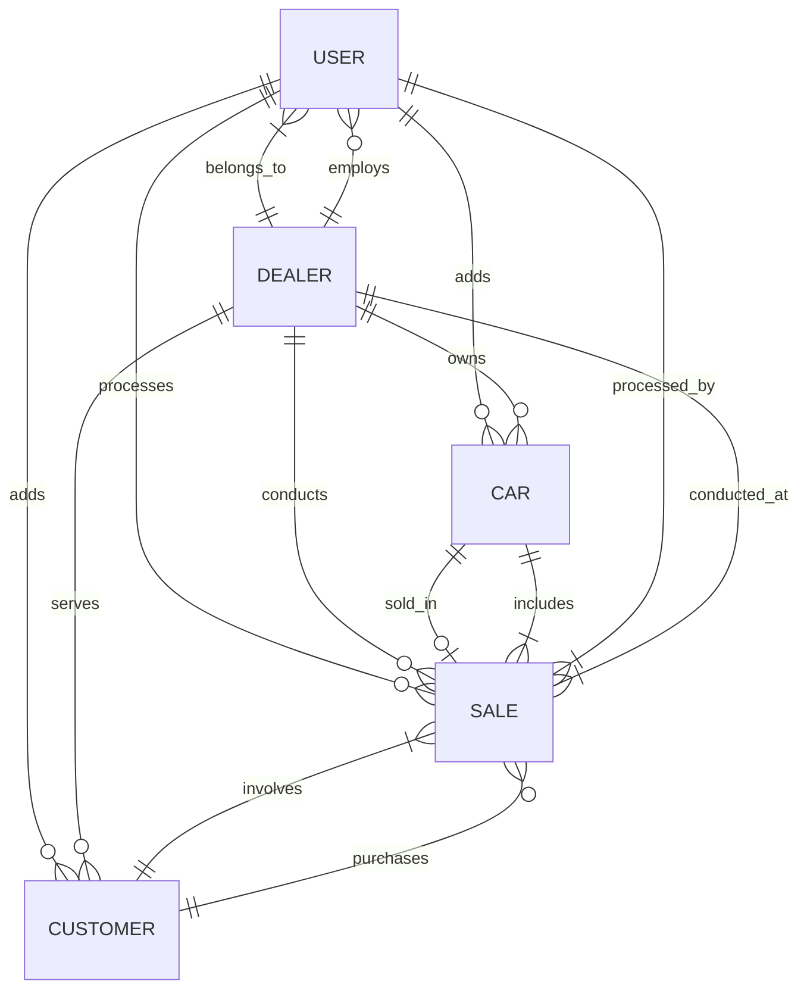

<p align="center">
  
</p>

<p align="center">
  <strong>AutoDealer Pro - Car Dealership Management System</strong>
</p>

<p align="center">
  A comprehensive full-stack car dealership management application with complete inventory tracking, customer management, sales processing, and multi-dealer support.
</p>

<p align="center">
  <a href="https://expressjs.com/" target="_blank"></a>
  <a href="https://www.mongodb.com/" target="_blank"></a>
  <a href="https://reactjs.org/" target="_blank"></a>
  <a href="https://chakra-ui.com/" target="_blank"></a>
  <a href="https://vitejs.dev/" target="_blank"></a>
</p>

<p align="center">
  <a href="https://github.com/TlokotseSM/Car-Dealership-Management-System/stargazers" target="_blank"></a>
  <a href="https://github.com/TlokotseSM/Car-Dealership-Management-System/network" target="_blank"></a>
  <a href="https://github.com/TlokotseSM/Car-Dealership-Management-System/issues" target="_blank"></a>
  <a href="https://github.com/TlokotseSM/Car-Dealership-Management-System/blob/main/LICENSE" target="_blank"></a>
</p>

---

# 🚗 AutoDealer Pro - Car Dealership Management System

A modern, full-stack web application designed to streamline car dealership operations with comprehensive inventory management, customer relationship tools, sales tracking, and multi-dealer support. Built with cutting-edge technologies for scalability and performance.

## 🎯 Project Overview

AutoDealer Pro empowers car dealerships to:

- **Manage Vehicle Inventory** - Complete car catalog with detailed specifications and images
- **Track Customer Relations** - Comprehensive customer profiles and interaction history
- **Process Sales** - End-to-end sales workflow with financing and trade-in support
- **Support Multiple Dealers** - Multi-tenant architecture for dealer networks
- **Generate Reports** - Real-time analytics and business insights
- **Secure Operations** - Role-based access control and data protection

## ✨ Core Features

### 🔐 Authentication & User Management

- **Secure Registration & Login** - JWT-based authentication with password encryption
- **Role-Based Access Control** - Admin, dealer, and salesperson permission levels
- **User Profile Management** - Avatar uploads and profile customization
- **Session Management** - Secure token handling and automatic logout
- **Password Security** - bcrypt hashing with salt rounds
- **Account Recovery** - Password reset functionality

### 🚙 Vehicle Inventory Management

- **Complete Car Catalog** - Make, model, year, pricing, and specifications
- **Image Gallery** - Multiple high-quality vehicle photos with upload support
- **VIN Tracking** - Unique vehicle identification and history
- **Condition Management** - New, used, and certified pre-owned categories
- **Status Tracking** - Available, sold, pending, and reserved statuses
- **Advanced Search** - Filter by make, model, price range, year, and features
- **Inventory Reports** - Stock levels and vehicle analytics

### 👥 Customer Relationship Management

- **Customer Profiles** - Complete contact information and preferences
- **Communication Tracking** - Preferred contact methods and interaction history
- **Credit Management** - Credit score tracking and financing eligibility
- **Address Management** - Complete address records with validation
- **Customer Analytics** - Purchase history and behavior insights
- **Lead Management** - Prospect tracking and follow-up systems

### 🏢 Multi-Dealer Support

- **Dealer Profiles** - Business information and branding
- **Location Management** - Multiple dealership locations
- **Operating Hours** - Business hours and availability tracking
- **License Tracking** - Dealer license numbers and compliance
- **Specialty Management** - Dealer specializations and focus areas
- **Performance Analytics** - Dealer-specific metrics and reporting

### 💰 Sales Management System

- **Complete Sales Workflow** - From inquiry to delivery tracking
- **Financing Integration** - Loan calculations and lender management
- **Trade-In Processing** - Vehicle appraisal and trade-in values
- **Payment Processing** - Multiple payment methods support
- **Document Generation** - Automated sales contracts and paperwork
- **Commission Tracking** - Salesperson performance and compensation
- **Sales Analytics** - Revenue reports and performance metrics

### 📊 Analytics & Reporting

- **Sales Dashboard** - Real-time sales performance metrics
- **Inventory Analytics** - Stock levels and turnover rates
- **Customer Insights** - Demographics and buying patterns
- **Financial Reports** - Revenue, profit, and expense tracking
- **Performance Metrics** - Salesperson and dealer comparisons
- **Export Capabilities** - PDF and Excel report generation

## 🏗️ Architecture & Technology Stack

### **Full-Stack Architecture**

```
┌─────────────────────────────────────┐
│           Frontend (React)          │
│      Chakra UI + Vite + Router      │
├─────────────────────────────────────┤
│           API Gateway               │
│         Express.js Server           │
├─────────────────────────────────────┤
│           Business Logic            │
│       Controllers & Services        │
├─────────────────────────────────────┤
│           Data Layer                │
│        MongoDB + Mongoose           │
└─────────────────────────────────────┘
```

### **Technology Stack**

#### **Backend Technologies**
- **Express.js** - Fast, unopinionated web framework
- **MongoDB** - Document-based NoSQL database
- **Mongoose** - MongoDB object modeling
- **JWT** - Secure authentication tokens
- **Multer** - File upload middleware
- **Helmet** - Security headers
- **Morgan** - Request logging

#### **Frontend Technologies**
- **React 18** - Modern UI library with hooks
- **Chakra UI** - Modular and accessible component library
- **Vite** - Lightning-fast build tool
- **React Router** - Client-side routing
- **React Query** - Server state management
- **React Hook Form** - Performant form handling
- **Axios** - HTTP client for API calls

### **Design Patterns Implemented**

#### **1. MVC Pattern**
- **Models** - MongoDB schemas with Mongoose
- **Views** - React components with Chakra UI
- **Controllers** - Express route handlers

#### **2. Service Layer Pattern**
- **Business Logic** - Separated service classes
- **Data Access** - Repository pattern with models
- **API Layer** - Clean controller interfaces

#### **3. Component-Based Architecture**
- **Reusable Components** - Modular UI components
- **Custom Hooks** - Shared state logic
- **Context API** - Global state management

#### **4. Authentication Middleware**
- **JWT Strategy** - Stateless authentication
- **Route Protection** - Middleware guards
- **Role-Based Access** - Permission checking

## 🗂️ Domain Model & Data Relationships

Below is the entity-relationship diagram showing how the core business objects interact:



### **Entity Descriptions**

#### **User**
- Represents system users (admin, dealer, salesperson)
- Belongs to a specific dealer (except admins)
- Can add cars, customers, and process sales
- Role-based permissions and authentication

#### **Dealer**
- Represents a car dealership business
- Can have multiple users, cars, customers, and sales
- Contains business information and operating details
- Supports multi-tenant architecture

#### **Car**
- Represents individual vehicles in inventory
- Belongs to a specific dealer
- Added by authorized users
- Contains complete vehicle specifications and images

#### **Customer**
- Represents potential and actual car buyers
- Associated with a specific dealer
- Added by authorized users
- Contains contact information and preferences

#### **Sale**
- Represents completed vehicle transactions
- Links car, customer, dealer, and salesperson
- Contains pricing, financing, and payment details
- Tracks complete sales workflow

---

## 📁 Project Structure

```
car-dealership/
├── backend/                           # Express.js API server
│   ├── src/
│   │   ├── config/                    # Configuration files
│   │   │   ├── database.js            # MongoDB connection
│   │   │   └── config.js              # App configuration
│   │   ├── controllers/               # Route handlers
│   │   │   ├── authController.js      # Authentication logic
│   │   │   ├── carController.js       # Vehicle management
│   │   │   ├── customerController.js  # Customer management
│   │   │   ├── dealerController.js    # Dealer management
│   │   │   └── saleController.js      # Sales processing
│   │   ├── middleware/                # Express middleware
│   │   │   ├── auth.js                # JWT authentication
│   │   │   ├── validation.js          # Input validation
│   │   │   ├── errorHandler.js        # Error handling
│   │   │   └── upload.js              # File upload handling
│   │   ├── models/                    # MongoDB schemas
│   │   │   ├── User.js                # User model
│   │   │   ├── Car.js                 # Vehicle model
│   │   │   ├── Customer.js            # Customer model
│   │   │   ├── Dealer.js              # Dealer model
│   │   │   └── Sale.js                # Sales model
│   │   ├── routes/                    # API routes
│   │   │   ├── auth.js                # Auth endpoints
│   │   │   ├── cars.js                # Car endpoints
│   │   │   ├── customers.js           # Customer endpoints
│   │   │   ├── dealers.js             # Dealer endpoints
│   │   │   └── sales.js               # Sales endpoints
│   │   ├── services/                  # Business logic
│   │   │   ├── authService.js         # Auth operations
│   │   │   ├── carService.js          # Car operations
│   │   │   ├── customerService.js     # Customer operations
│   │   │   ├── dealerService.js       # Dealer operations
│   │   │   └── saleService.js         # Sales operations
│   │   └── utils/                     # Utility functions
│   │       ├── validators.js          # Custom validators
│   │       ├── helpers.js             # Helper functions
│   │       └── constants.js           # App constants
│   └── uploads/                       # File storage
│       └── cars/                      # Car images
├── frontend/                          # React client application
│   ├── public/                        # Static assets
│   │   ├── images/                    # App images
│   │   └── index.html                 # Main HTML file
│   ├── src/
│   │   ├── components/                # React components
│   │   │   ├── common/                # Shared components
│   │   │   │   ├── Header.jsx         # Navigation header
│   │   │   │   ├── Footer.jsx         # App footer
│   │   │   │   ├── LoadingSpinner.jsx # Loading indicator
│   │   │   │   ├── ErrorBoundary.jsx  # Error handling
│   │   │   │   └── ProtectedRoute.jsx # Route protection
│   │   │   ├── auth/                  # Authentication components
│   │   │   ├── cars/                  # Car management components
│   │   │   ├── customers/             # Customer components
│   │   │   ├── dealers/               # Dealer components
│   │   │   └── sales/                 # Sales components
│   │   ├── pages/                     # Page components
│   │   │   ├── auth/                  # Auth pages
│   │   │   ├── cars/                  # Car pages
│   │   │   ├── customers/             # Customer pages
│   │   │   ├── dealers/               # Dealer pages
│   │   │   ├── sales/                 # Sales pages
│   │   │   └── dashboard/             # Dashboard page
│   │   ├── hooks/                     # Custom React hooks
│   │   ├── services/                  # API service calls
│   │   ├── context/                   # React context providers
│   │   ├── utils/                     # Utility functions
│   │   ├── App.jsx                    # Main app component
│   │   ├── main.jsx                   # App entry point
│   │   └── theme.js                   # Chakra UI theme
│   ├── package.json                   # Frontend dependencies
│   └── vite.config.js                 # Vite configuration
├── README.md                          # Project documentation
├── .gitignore                         # Git ignore rules
└── package.json                       # Root package file
```

## 🚀 Quick Start

### **Prerequisites**

- Node.js (v18 or higher)
- MongoDB (local installation or cloud instance)
- npm or yarn package manager
- Git for version control

### **Installation**

1. **Clone the repository:**

   ```bash
   git clone https://github.com/TlokotseSM/Car-Dealership-Management-System.git
   cd car-dealership-pro
   ```

2. **Backend Setup:**

   ```bash
   cd backend
   npm install
   ```

   Create `.env` file in backend directory:
   ```env
   NODE_ENV=development
   PORT=5000
   MONGODB_URI=mongodb://localhost:27017/car-dealership
   JWT_SECRET=your_super_secret_jwt_key_here
   JWT_EXPIRES_IN=7d
   CLIENT_URL=http://localhost:5173
   ```

3. **Frontend Setup:**

   ```bash
   cd ../frontend
   npm install
   ```

   Create `.env` file in frontend directory:
   ```env
   VITE_API_URL=http://localhost:5000/api
   ```

4. **Start the Development Servers:**

   **Backend (Terminal 1):**
   ```bash
   cd backend
   npm run dev
   ```

   **Frontend (Terminal 2):**
   ```bash
   cd frontend
   npm run dev
   ```

5. **Access the application:**
   - **Frontend:** http://localhost:5173
   - **Backend API:** http://localhost:5000/api
   - **Health Check:** http://localhost:5000/api/health

## 📚 API Documentation

### **Authentication Endpoints**

#### **Register User**
```http
POST /api/auth/register
Content-Type: application/json

{
  "firstName": "John",
  "lastName": "Masemola",
  "email": "john@email.com",
  "password": "password123",
  "role": "salesperson",
  "phone": "+1234567890"
}
```

#### **Login User**
```http
POST /api/auth/login
Content-Type: application/json

{
  "email": "john@email.com",
  "password": "password123"
}
```

### **Car Management Endpoints**

#### **Get All Cars**
```http
GET /api/cars
Authorization: Bearer {jwt_token}
```

#### **Add New Car**
```http
POST /api/cars
Authorization: Bearer {jwt_token}
Content-Type: application/json

{
  "make": "Toyota",
  "model": "Camry",
  "year": 2023,
  "price": 28500,
  "mileage": 0,
  "color": "White",
  "transmission": "automatic",
  "fuelType": "gasoline",
  "bodyType": "sedan",
  "vin": "1HGBH41JXMN109186"
}
```

### **Customer Management Endpoints**

#### **Get All Customers**
```http
GET /api/customers
Authorization: Bearer {jwt_token}
```

#### **Add New Customer**
```http
POST /api/customers
Authorization: Bearer {jwt_token}
Content-Type: application/json

{
  "firstName": "Jane",
  "lastName": "Smith",
  "email": "jane@email.com",
  "phone": "+2787654321",
  "address": {
    "street": "123 Main St",
    "city": "Anytown",
    "state": "CA",
    "zipCode": "12345"
  }
}
```

### **Sales Endpoints**

#### **Create New Sale**
```http
POST /api/sales
Authorization: Bearer {jwt_token}
Content-Type: application/json

{
  "carId": "car_object_id",
  "customerId": "customer_object_id",
  "salePrice": 28500,
  "downPayment": 5000,
  "paymentMethod": "financing",
  "financing": {
    "isFinanced": true,
    "loanAmount": 23500,
    "interestRate": 4.5,
    "loanTerm": 60
  }
}
```

## 🗄️ Database Schema

### **Users Collection**

| Field         | Type      | Description              |
|---------------|-----------|--------------------------|
| `_id`         | ObjectId  | Unique identifier        |
| `firstName`   | String    | User's first name        |
| `lastName`    | String    | User's last name         |
| `email`       | String    | Email address (unique)   |
| `password`    | String    | Hashed password          |
| `role`        | String    | User role (enum)         |
| `phone`       | String    | Phone number             |
| `avatar`      | String    | Profile image URL        |
| `isActive`    | Boolean   | Account status           |
| `dealerId`    | ObjectId  | Reference to dealer      |
| `createdAt`   | Date      | Creation timestamp       |
| `updatedAt`   | Date      | Last update timestamp    |

### **Cars Collection**

| Field         | Type      | Description              |
|---------------|-----------|--------------------------|
| `_id`         | ObjectId  | Unique identifier        |
| `make`        | String    | Vehicle manufacturer     |
| `model`       | String    | Vehicle model            |
| `year`        | Number    | Manufacturing year       |
| `price`       | Number    | Selling price            |
| `mileage`     | Number    | Vehicle mileage          |
| `color`       | String    | Vehicle color            |
| `transmission`| String    | Transmission type (enum) |
| `fuelType`    | String    | Fuel type (enum)         |
| `bodyType`    | String    | Body style (enum)        |
| `vin`         | String    | Vehicle identification   |
| `images`      | [String]  | Image URLs array         |
| `status`      | String    | Availability status      |
| `dealerId`    | ObjectId  | Reference to dealer      |
| `addedBy`     | ObjectId  | Reference to user        |

### **Sales Collection**

| Field         | Type      | Description              |
|---------------|-----------|--------------------------|
| `_id`         | ObjectId  | Unique identifier        |
| `saleNumber`  | String    | Unique sale number       |
| `carId`       | ObjectId  | Reference to car         |
| `customerId`  | ObjectId  | Reference to customer    |
| `dealerId`    | ObjectId  | Reference to dealer      |
| `salespersonId`| ObjectId | Reference to salesperson |
| `salePrice`   | Number    | Final sale price         |
| `downPayment` | Number    | Down payment amount      |
| `financing`   | Object    | Financing details        |
| `status`      | String    | Sale status (enum)       |
| `saleDate`    | Date      | Sale completion date     |
| `totalAmount` | Number    | Total transaction amount |

## 🔧 Development

### **Available Scripts**

#### **Backend Scripts**
```bash
npm run dev          # Start development server with hot reload
npm start            # Start production server
npm run test         # Run backend tests
```

#### **Frontend Scripts**
```bash
npm run dev          # Start Vite development server
npm run build        # Build for production
npm run preview      # Preview production build
npm run lint         # Run ESLint
```

### **Environment Variables**

#### **Backend Environment**

| Variable         | Description                  | Default       | Required |
|------------------|------------------------------|---------------|----------|
| `NODE_ENV`       | Environment mode             | `development` | ❌       |
| `PORT`           | Server port                  | `5000`        | ❌       |
| `MONGODB_URI`    | MongoDB connection string    | -             | ✅       |
| `JWT_SECRET`     | JWT signing secret           | -             | ✅       |
| `JWT_EXPIRES_IN` | JWT token expiration         | `7d`          | ❌       |
| `CLIENT_URL`     | Frontend URL for CORS        | -             | ✅       |

#### **Frontend Environment**

| Variable          | Description              | Default                    | Required |
|-------------------|--------------------------|----------------------------|----------|
| `VITE_API_URL`    | Backend API base URL     | `http://localhost:5000/api`| ✅       |

## 🛡️ Security Features

### **Authentication & Authorization**

- **JWT Tokens** - Stateless authentication with configurable expiration
- **Password Hashing** - bcrypt with 12 salt rounds for maximum security
- **Role-Based Access** - Admin, dealer, and salesperson permission levels
- **Input Validation** - Comprehensive request validation using express-validator
- **Rate Limiting** - Protection against brute force attacks

### **Data Protection**

- **Environment Variables** - Sensitive configuration stored securely
- **CORS Protection** - Configurable cross-origin resource sharing
- **Helmet Security** - Security headers for protection
- **File Upload Security** - Restricted file types and size limits
- **SQL Injection Prevention** - Mongoose parameterized queries

### **Frontend Security**

- **Protected Routes** - Authentication required for sensitive areas
- **Input Sanitization** - XSS prevention through proper validation
- **Secure Storage** - JWT tokens stored securely
- **Error Handling** - No sensitive information leaked in errors

## 🚀 Deployment

### **Production Environment**

#### **Backend Deployment**

```dockerfile
FROM node:18-alpine

WORKDIR /app

COPY package*.json ./
RUN npm ci --only=production

COPY src ./src

EXPOSE 5000

CMD ["npm", "start"]
```

#### **Frontend Deployment**

```dockerfile
FROM node:18-alpine as build

WORKDIR /app
COPY package*.json ./
RUN npm ci

COPY . .
RUN npm run build

FROM nginx:alpine
COPY --from=build /app/dist /usr/share/nginx/html
EXPOSE 80
CMD ["nginx", "-g", "daemon off;"]
```

### **Deployment Platforms**

- **Heroku** - Easy deployment with MongoDB Atlas
- **Vercel** - Frontend deployment with serverless functions
- **DigitalOcean** - VPS deployment with managed databases
- **AWS** - Scalable cloud deployment with RDS/DocumentDB
- **Railway** - Simple full-stack deployment

## 📈 Roadmap

### **Phase 1: Core Functionality** ✅
- [x] User authentication and authorization
- [x] Basic CRUD operations for all entities
- [x] Database schema design
- [x] API endpoint structure
- [x] Frontend component architecture

### **Phase 2: Advanced Features** 🚧
- [ ] Image upload and management
- [ ] Advanced search and filtering
- [ ] Sales workflow automation
- [ ] Reporting and analytics dashboard
- [ ] Email notifications

### **Phase 3: Business Features** 📋
- [ ] Financing calculator integration
- [ ] Document generation (contracts, invoices)
- [ ] Customer communication portal
- [ ] Inventory alerts and notifications
- [ ] Multi-location support

### **Phase 4: Advanced Analytics** 📊
- [ ] Sales performance tracking
- [ ] Customer behavior analytics
- [ ] Inventory optimization
- [ ] Predictive analytics
- [ ] Business intelligence dashboard

### **Phase 5: Integration & Mobile** 🔗
- [ ] Third-party integrations (CRM, accounting)
- [ ] Mobile application
- [ ] API for external systems
- [ ] Webhook support
- [ ] Real-time notifications

## 🤝 Contributing

We welcome contributions to AutoDealer Pro! Please follow these guidelines:

### **Getting Started**

1. Fork the repository
2. Create a feature branch: `git checkout -b feature/amazing-feature`
3. Make your changes and test thoroughly
4. Commit your changes: `git commit -m 'Add amazing feature'`
5. Push to the branch: `git push origin feature/amazing-feature`
6. Open a Pull Request

### **Development Guidelines**

- Follow existing code style and conventions
- Write comprehensive tests for new features
- Update documentation for any changes
- Ensure all tests pass before submitting
- Use meaningful commit messages

### **Code Review Process**

- All contributions must go through code review
- At least one maintainer approval required
- Automated tests must pass
- Documentation must be updated

## 📞 Support & Community

### **Getting Help**

- **Documentation:** [Project Wiki](https://github.com/TlokotseSM/Car-Dealership-Management-System/wiki)
- **Issues:** [GitHub Issues](https://github.com/TlokotseSM/Car-Dealership-Management-System/issues)
- **Discussions:** [GitHub Discussions](https://github.com/TlokotseSM/Car-Dealership-Management-System/discussions)

### **Community**

- **Discord:** Join our community server
- **Twitter:** [@AutoDealerPro](https://twitter.com/autodealerpro)
- **Blog:** Read our development updates

## 📄 License

This project is licensed under the MIT License - see the [LICENSE](LICENSE) file for details.

## 🙏 Acknowledgments

- **Express.js Team** - For the robust web framework
- **MongoDB Team** - For the flexible database solution
- **React Team** - For the powerful UI library
- **Chakra UI Team** - For the beautiful component library
- **Vite Team** - For the lightning-fast build tool

## 👨‍💻 Authors

**Your Name**
- **LinkedIn:** [Tlokotse Mogudi](https://www.linkedin.com/in/tlokotse-mogudi/)
- **GitHub:** [@TlokotseSM](https://github.com/TlokotseSM)
- **Portfolio:** [tlokotsesm.github.io](https://tlokotsesm.github.io/tlokotse-portfolio/)
- **Email:** tlokotsemogudi@gmail.com

---

<p align="center">
  ⭐️ <b>If you find this project helpful, please consider <a href="https://github.com/TlokotseSM/Car-Dealership-Management-System/stargazers">starring it on GitHub</a>!</b> ⭐️
</p>

<p align="center">
  <a href="https://buymeacoffee.com/TlokotseSM" target="_blank"></a>
</p>

---

## 🚀 Spread the Word

Share AutoDealer Pro with the automotive and development communities!

- **Tweet:** [Share on Twitter](https://twitter.com/intent/tweet?text=Check%20out%20AutoDealer%20Pro%20-%20a%20comprehensive%20car%20dealership%20management%20system!%20https://github.com/TlokotseSM/Car-Dealership-Management-System)
- **LinkedIn:** [Share on LinkedIn](https://www.linkedin.com/shareArticle?mini=true&url=https://github.com/TlokotseSM/Car-Dealership-Management-System&title=AutoDealer%20Pro%20Car%20Dealership%20Management%20System)
- **Star:** ⭐️ [Star this repository](https://github.com/TlokotseSM/Car-Dealership-Management-System/stargazers)

---

<p align="center">
  <b>Made with ❤️ for the automotive industry and developer community.</b>
</p>